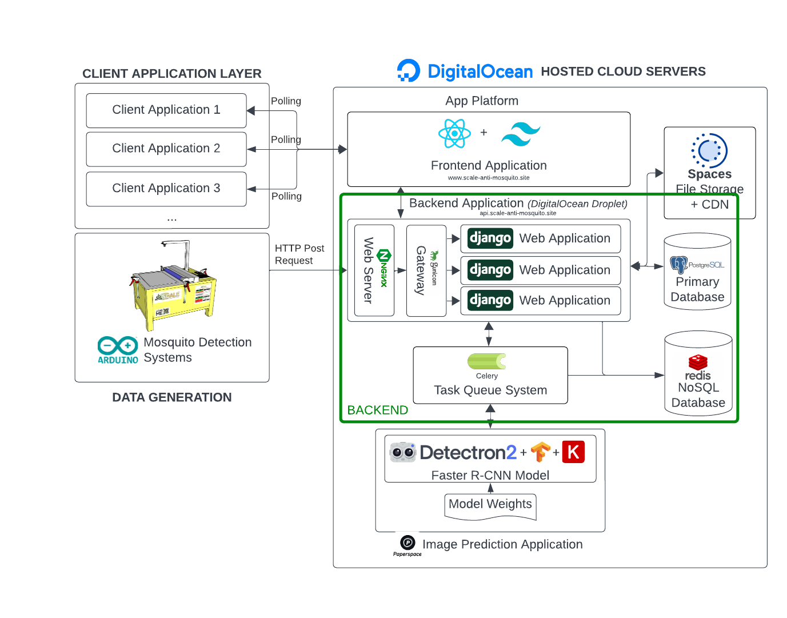

# SCALE - Mosquito Detection and Fumigation (Deep Learning)

This repo is part of our thesis project entitled "**SCALE: Mosquito Detection and Fumigation System Utilizing Convolutional Neural Networks**". The project aims to develop a deep learning model for detecting and localizing mosquitoes in images. The model will be used to support fumigation efforts by identifying areas with high mosquito populations. This repository  involves the backend API of the project, utilizing Django REST Framework and Celery for the model's deployment.

Checkout our [website](https://www.scale-anti-mosquito.site)! 

Other repositories:
- [Website's Frontend Repository](https://github.com/PeteCastle/SCALE-Frontend)
- [RCNN Model](https://github.com/PeteCastle/SCALE-Model)
- [Prototype's Arduino Code](https://github.com/PeteCastle/SCALE-Arduino)


### Setting Up
1. Create your own environment. Suggested Python version: 3.10
2. `pip install -r requirements.txt`

#### If running as a Django server:
1. ```python manage.py runserver``` 
2. Make sure to upload static files, migrations, and create a superuser account before starting the server.

#### If running as a Celery worker:
1. `pip install requirements_model.txt`
2. `pip3 install torch==1.10.1+cu113 torchvision==0.11.2+cu113 torchaudio===0.10.1+cu113 -f https://download.pytorch.org/whl/cu113/torch_stable.html` (Requires CUDA-Enabled Device)
3. Note: Worker will fail to start if CUDA is not available.
4. Run: ` celery -A MosquitoSite worker --loglevel=info`

#### Sample environment file `.env`:

```

ALLOWED_HOSTS=

POSTGRES_DB=
POSTGRES_USER=
POSTGRES_PASSWORD=
POSTGRES_HOST=
POSTGRES_PORT=
DEBUG=
SECRET_KEY=

SPACES_ACCESS_KEY=
SPACES_SECRET_KEY=
SPACES_REGION_NAME=
SPACES_BUCKET_NAME

REDIS_CONNECTION_URL=

```

### About the Website Stack


The software architecture for the website is a comprehensive system leveraging multiple layers and services. At the client application layer, multiple client applications (Client Application 1, 2, 3, etc.) interact with the system via a Web Service API that actively polls data every 5 seconds.

All servers are hosted on **Digital Ocean infrastructure**.  The frontend application is developed using **React.JS and Tailwind CSS** for styling.  All dynamic data (including charts, graphs, and KPIs) are polled every 5 seconds to the backend application developed using Django.  The backend application is a Digital Ocean droplet that uses nginx as a proxy to the Gunicorn, which is a gateway server that allows multiple instances of Django applications.  All data are stored using PostgreSQL that communicates seamlessly using Django’s ORM system.  For the static files, we’ve used Digital Ocean Spaces which servers as an object storage and CDN to retrieve static files on the internet.

Our image prediction system operates on a **task queue-based system**.  Due to the physical limitations of the Django server, we cannot enforce the image prediction directly as it would directly impact the performance of other APIs.  Instead, it is delegated in another GPU-enabled server that has CUDA capabilities.  Django will send tasks via Celery, where input parameters are temporarily stored on Redis server, a NoSQL Database.  The image prediction application will then listen for tasks provided by the Celery app.

The Data Generation segment includes a Mosquito Detection and Fumigation System, interacting with the backend server. Raw photos are sent via HTTP POST Requests to the server, and subsequently, a 201 response is created, but the detection is deferred until the image prediction application processes the task.  	

This architecture exhibits a robust and scalable design, incorporating Django, Docker, Azure services, and deep learning technologies, to power a web-based platform for efficient client interaction, data storage, content delivery, and real-time deep learning inference for mosquito detection and management.


